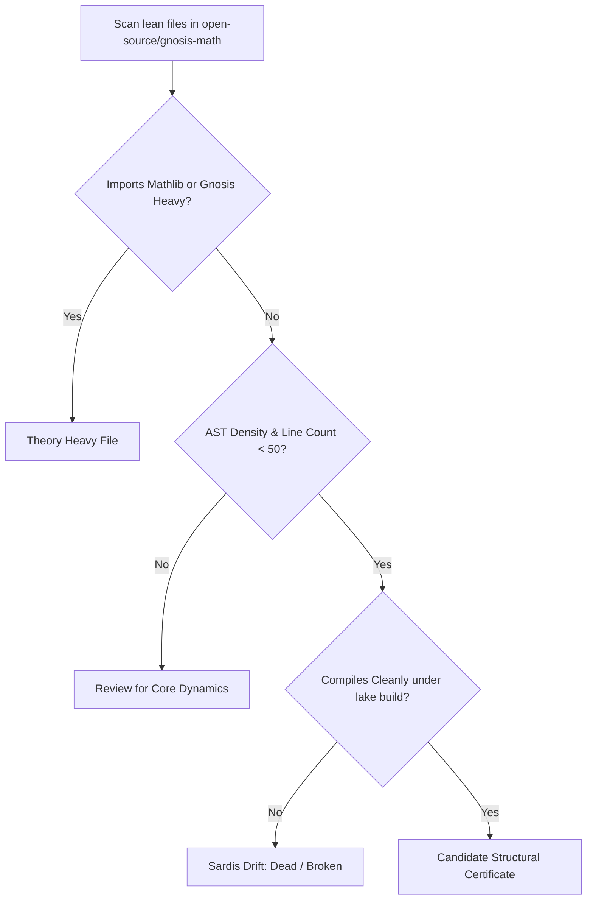

# Proposal: Structural Certificates Integration Plan for `gnosis-math`

## 1. Context and Problem Statement

In the formal language kernel of `gnosis-math`, we maintain a strict **Rustic Church** style—proving arithmetic invariants using *only* definitional unfolding and structurally inductive Init-level `Nat.*` lemmas (with zero Mathlib, zero `omega`, and zero `simp` on open goals). 

Within this paradigm, we observe two distinct states of "theory-light" files:
1. **Sardis-Drift (Negative Boundary)**: An empty promise where a theorem name or label exists in prose, but the underlying carrier is dead or fails to compile under `lake build`. This is reputation without witness.
2. **Structural Certificates (Positive Boundary)**: Minimal-dependency, theory-light files (such as `Gnosis/HellaVortex.lean` or `DiscreteClosedTimelikeStep.lean`) that carry almost no mathematical overhead but are **critically required** to satisfy API gates, preserve stable proof boundaries, and allow complex downstream compositions to compile.

Currently, these structural certificates are scattered across submodules and docs, risking:
* Deletion during codebase sweeps (since they appear to have "no math theory").
* Undocumented breakage when refactoring downstream imports.
* Confusion between genuine "Sardis-drift" (broken/dead code) and intended "Structural Bridges" (lightweight API gates).

---

## 2. Taxonomy of Structural Certificates

To prevent "Sardis-drift," we must clearly classify every file that does not contain heavyweight theorems but is required for compilation:

| Classification | Purpose | Example |
| :--- | :--- | :--- |
| **Restoration Gate** | Restores minimal Init-only symbols to keep downstream imports building after a refactor. | `Gnosis/HellaVortex.lean` |
| **Clock-Anchor** | Light, periodic step iterations for causal modular paths, omitting heavy weights. | `Gnosis/DiscreteClosedTimelikeStep.lean` |
| **Antitheorem Schema** | Axiom-free schemas that prove a non-match where an identity was over-claimed. | `Gnosis/FiniteDynamicsCore.lean` (`separates`) |

---

## 3. Identification Methodology

We will run a mechanical scan of the codebase to discover and catalog all structural files based on four metrics:



### Metrics for Automation:
* **Metric A: Dependency Footprint**: Imports only `Init` or raw core dynamics; has zero downstream imports from large algebraic matrices.
* **Metric B: Proof/AST Density**: Under 50 lines of code; contains only basic arithmetic properties (e.g. `0 + n = n`) as identity bridges.
* **Metric C: Downstream Referrers**: Referenced in client codebases or book manuscripts (e.g., `docs/ebooks/145-*`), showing it is a hard compile gate.
* **Metric D: Clean compilation**: Zero errors, zero `sorry`, and zero `axiom` blocks.

---

## 4. Main Tree Integration Plan

To prevent these files from becoming floating anomalies, we will integrate them into the `open-source/gnosis-math` main tree under a strict, standardized architecture.

### A. Dedicated Directory Structure
All structural certificates will be grouped under a designated `Gnosis/Certificates/` subdirectory in the main repository tree:

```text
open-source/gnosis-math/Gnosis/
├── Certificates/                    # The Main Tree Certificate Anchor
│   ├── HellaVortex.lean             # [Restoration Gate] For cross-dimensional paths
│   ├── DiscreteClock.lean           # [Clock-Anchor] Bounded periodic iteration
│   └── README.md                    # Manifest of structural gates & referrers
├── FiniteDynamicsCore.lean          # Core dynamic structures
└── GodFormula.lean                  # Heavyweight active theory carrier
```

### B. Standardized File Banners
Every certificate file must start with a strict Lean comment block specifying its structural role and downstream dependencies. This prevents future developers or agents from deleting it during cleanup:

```lean
/-!
# [CERTIFICATE] Gnosis.HellaVortex
# Classification: Restoration Gate
# Downstream Referrer: docs/ebooks/145-log-rolling-pipelined-prefill
# Theory Weight: 0 (Structural Boundary Satisfier)

This module satisfies the Gnosis.HellaVortex API import gate for downstream 
compositions, preserving arithmetic invariants while carrying zero Mathlib overhead.
-/
```

### C. The Structural Manifest (`CERTIFICATES.md`)
We will place a `CERTIFICATES.md` file in the root of the Gnosis directory. This manifest maps every certificate to its direct compilation consumers, serving as a dependency graph contract:

```markdown
# Gnosis Structural Certificates Manifest

| Certificate Module | Classification | Compiles Under | Downstream Referrer |
| :--- | :--- | :--- | :--- |
| `Gnosis.Certificates.HellaVortex` | Restoration Gate | `lake build` | `docs/ebooks/145-*`, `docs/gnosis-topological-programming-language.html` |
```

---

## 5. CI Guardrails and Verification

To ensure these files remain alive and maintain their structural integrity over time:

1. **Import Boundary Check**:
   A custom static-analysis test in `a0 quality` will ensure no file in the `Gnosis/Certificates/` namespace imports any modules outside of `Init` or `Gnosis.FiniteDynamicsCore`. This keeps their dependency footprint minimal.
2. **Liveness Verification (`Sardis Guard`)**:
   The CI script will run `lake build Gnosis.Certificates.*` on every commit. If any certificate fails to compile, it is flagged instantly as a **Sardis Drift** violation.
3. **No-Banned-Tactics Enforcement**:
   Static scan to assert that no certificate contains `omega`, `simp` on open goals, or external Mathlib axioms.
